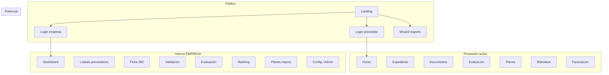

# Sitemap demo — Portal Proveedores EMPRESA

**Fecha:** 2026-03-24  
**Referencias:** `requerimientos-portal-empresa.md` §5–8, `guion-demo-cliente.md`, `auditoria-demo-actual.md`  
**Estado:** arquitectura propuesta (Fase 2); implementación pendiente.

---

## 1. Visión general

La demo se organiza en **cinco experiencias** con layout y menú propios (o sin menú en auth):

1. **Público** — landing, recuperación de contraseña, wizard de alta potencial.  
2. **Proveedor potencial** — mismo layout público compacto o wizard a pantalla completa.  
3. **Proveedor activo** — shell horizontal + home hub.  
4. **Usuario interno EMPRESA** — shell lateral ejecutivo/operativo.  
5. **Administración** — subconjunto del shell interno con rutas y menú restringidos (puede ser el mismo layout con sección “Administración”).

---

## 2. Layouts propuestos

| Layout | Uso | Elementos UI mínimos |
|--------|-----|----------------------|
| **PublicLayout** | `/`, `/recuperar-contrasena`, páginas legales opcionales | Cabecera ligera con logo EMPRESA, sin menú de app; pie opcional. |
| **RegistrationLayout** | Prefijo `/registro/*` | Stepper fijo visible, título del paso, botones Anterior / Siguiente / Guardar borrador, área de contenido. |
| **AuthCardLayout** | (actual `AuthShell`) | `/login/proveedor`, `/login/empresa` — card centrada estilo wireframe. |
| **ProviderShell** | `/proveedor/*` | Header + menú horizontal por rol proveedor; breadcrumbs en vistas profundas. |
| **InternalShell** | `/app/*` | Header + sidebar filtrado por rol interno; breadcrumbs en ficha, validación, evaluación, planes. |
| **Sin layout** | `/sin-acceso`, redirecciones | Página mínima. |

---

## 3. Sitemap por rol

### 3.1 Público (sin sesión)

```
/                                    Landing (FR-01, FR-02)
├── /login/proveedor                 CTA “Soy proveedor” (FR-03, FR-05)
├── /login/empresa                   Acceso interno (FR-07) — visible desde landing o footer
├── /recuperar-contrasena            Recuperación (FR-06) — común o duplicar entrada desde cada login
└── /registro/*                      Flujo “Quiero ser proveedor” (FR-04, FR-08–12)
    ├── …/datos
    ├── …/clasificacion
    ├── …/cuestionario
    ├── …/documentos
    └── …/confirmacion
```

**Opcional demo:** `/registro/seguimiento/:tokenMock` para FR-15 (consulta de estatus sin login).

---

### 3.2 Proveedor potencial

Mismo árbol que **público** en `/registro/*`. No requiere sesión en demo; el stepper puede guardar estado en `sessionStorage` o mock.

- **Entrada:** solo desde landing “Quiero ser proveedor” (y enlace directo para pruebas).
- **Salida:** pantalla de confirmación con CTA “Volver al inicio” o “Ir a login” cuando ya es proveedor (copy informativo).

---

### 3.3 Proveedor activo (sesión rol Proveedor)

Menú principal sugerido (orden lectura izquierda → derecha o agrupado):

| Ítem | Ruta base | Notas |
|------|-----------|--------|
| Inicio | `/proveedor` → redirect `/proveedor/home` | Hub FR-16–18 |
| Mi expediente | `/proveedor/expediente` | FR-20; puede unificar vista sin obligar periodo REPSE en demo |
| Mis documentos | `/proveedor/documentos` | FR-11–12, 27–30; CTA carga/reemplazo |
| Mi evaluación | `/proveedor/evaluacion` | FR-39–45; detalle en subruta |
| Planes de mejora | `/proveedor/planes` | FR-52–54, 57 |
| Biblioteca | `/proveedor/biblioteca` | FR-34–35, 38 |
| Facturación | `/proveedor/enlaces` o `/proveedor/facturacion` | FR-81–82; página con CTA externo configurable |

**Subflujo opcional (reutilizar prototipo):** grupo “Operación” o menú secundario:

- `/proveedor/operacion/contratos`
- `/proveedor/operacion/periodos`
- `/proveedor/operacion/expediente/:periodoId` (legacy compatible)

Así se preserva valor REPSE sin tapar el storytelling general.

---

### 3.4 Usuario interno EMPRESA (no administración pura)

Roles de negocio objetivo (mapeo técnico en implementación, ver `rutas-propuestas.md`):

| Rol negocio | Enfoque menú |
|-------------|----------------|
| **Usuario de consulta** | Dashboard (lectura), Proveedores, Ficha 360 (lectura), Biblioteca lectura si aplica. |
| **Evaluador** | Lo anterior + Validación documental, Evaluación, Planes de mejora (seguimiento). |
| **Administrador por área** | Lo anterior + Ranking, reportes de área; solicitud de usuarios (mock). |
| **Administrador global** | Todo + Configuración documental, Usuarios y roles, Biblioteca (admin), Reportes/exportables. |

**Árbol de rutas internas (lógico):**

```
/app
├── /dashboard
├── /proveedores
├── /proveedores/:id                    Ficha 360
├── /proveedores/:id/expediente         Vista expediente interna (coherente con FR-20–21)
├── /proveedores/:id/contratos          Opcional (legacy)
├── /contratos/:id/periodos             Opcional (legacy)
├── /expediente/...                     Opcional (ruta actual profunda)
├── /validacion
├── /evaluacion
├── /evaluacion/:proveedorId            Captura / detalle interno
├── /ranking
├── /planes-mejora
├── /planes-mejora/:id
├── /reportes
├── /config/documentos                  Antes “catálogos”
├── /admin/usuarios
└── /admin/biblioteca
```

**Ranking:** solo en menú interno (guion §4.10, FR-47).

---

### 3.5 Administración (capa lógica)

No es obligatorio un tercer shell: basta **sección de menú** “Administración” visible solo para **Administrador global** (y parcialmente área según política demo).

Rutas agrupadas bajo `/app/config/*` y `/app/admin/*` como en el árbol anterior.

---

## 4. Mapa mental por actor (resumen)



---

## 5. Reglas transversales

- **CTA primario** por pantalla (req. §8.3): definido en `flujos-demo.md` y en implementación por vista.  
- **Sin pantallas huérfanas** (§8.4): cada vista tiene “Volver”, breadcrumb o ítem de menú activo.  
- **Profundidad** (§8.5): desde home de cada rol, la acción principal del guion en ≤2 clics (ajustar menú para que “Mis documentos”, “Validación”, etc. estén a 1 clic).  
- **Wizard** (§8.2): obligatorio en `/registro/*`; recomendado en evaluación por fases si la UI lo amerita.

---

## 6. Próximo documento

Detalle de secuencias paso a paso: `flujos-demo.md`.  
Tabla de rutas y guards: `rutas-propuestas.md`.
